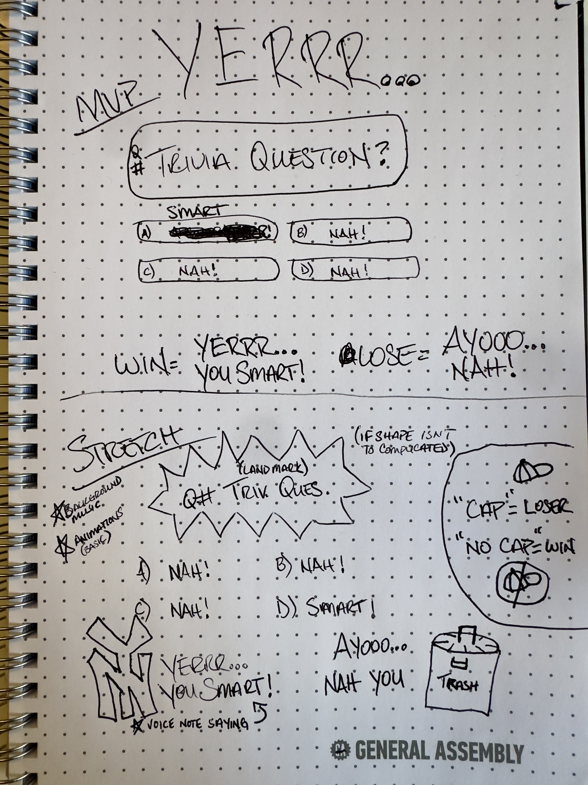

# YERRR... Smart or Nah! Proposal

## Project Choice
- Multiple Choice Quiz game

   
## Project Description  
#### Welcome to Brooklyn!  
- 'YERRR... Smart or Nah!' an online game where test your knowledge on the heart of NYC, BROOKLYN!!!  

 - It's multiple choice format and you guess the correct answer from up to 4 different options. It will track the progress of the user's responses and display a win/loss message at the END. Each game will have a choice between games with 5 or 10 questions. At then end of the game, the user will have an option to play another game or quit like a little...

## Wire Frames  

 

## User Stories

- #### MVP Goals

  - AAU I want to know I'm on the right webpage when it loads.
  - AAU I want to start a new quiz game to test how smart I am.
  - AAU I want to see a title screen when I start the game.
  - AAU I want to choose my answers.
  - AAU I want to see my choice highlighted before I submit it.
  - AAU I want audio/visual feedback on whether my answer was correct.
  - AAU I want to know my updated score after each answer.
  - AAU I want to know when the game/round has ended.

- #### Stretch Goals

  - AAU I want to add a custom Username
  - AAU I want to choose from at least 2 - 3 categories.
  - AAU I want to choose my difficulty
  - AAU I want some background music while I play.

## Pseudocode
  
  ### MVP
####  Game start
  - 'Welcome to Brooklyn!' message.
  - Homepage with the title of the game.
  - 'New Game' button to begin playing.

#### Playing the game
  - Display trivia question.
  - Display potential answer options (A, B, C, D).
  - Highlight player's answer choice.
  - Check player's answer choice 
  - IF correct show 'Smart' message, ELSE 'Nah!' for incorrect.
  - Check for next question.
  - IF there are more questions, load display next question and repeat previous steps; ELSE proceed to end of game

#### Ending the Game
  - Check player score
  - Display player score
  - IF player score is greater than 50% display 'YERRR... You Smart!' message; ELSE display 'NAH!'
  - Display 'We Out!' button to start new game.

  ### Stretch
  - Select category from choice of 2-3.
  - Select difficulty 'Say Less'(normal) or 'Oh Nah'(hard).
  - Display 10 sec timer per question
  - ForEach incorrect answer, player loses 1 second from timer ('Oh Nah' difficulty).
  - Display leaderboard with win total/percentage.

## Timeline
| Day        |   | Task                                                 | Notes/ Thoughts           |
|------------|---|------------------------------------------------------|---------------------------|
| Monday     |   | Discuss & create proposal                            |                           |
| Tuesday    |   | Present proposal for approval; Begin Scaffolding     |                           |
| Wednesday  |   | Idetify & define all constants/variables/elements    |                           |
| Thursday   |   | Write HTML content (ques., ans., etc.); Begin JS     |                           |
| Friday     |   | Work on game logic/functionality in JS               |                           |
| Saturday   |   | Finalize JS; Begin basic CSS styling                 |                           |
| Sunday     |   | Review CSS/JS; Check for bugs                        |                           |
| Monday     |   | Finalize MVP (If done, begin stretch goals)          |                           |
| Tuesday    |   | Work on stretch goals                                |                           |
| Wednesday  |   | Deploy project to the internet                       |                           |
| Thursday   |   | Presentation Day!                                    |                           |

